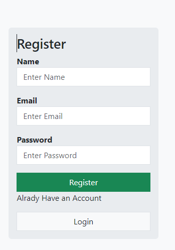
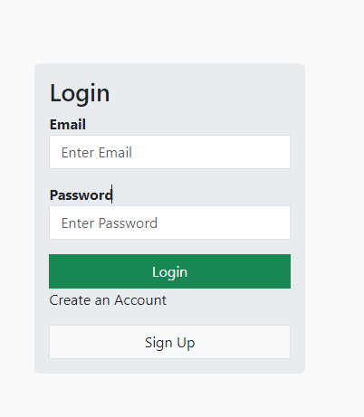

# Login & Register App

This is a simple login and register application built using **Node.js**, **React.js**, **Bootstrap**, and **Express**. The application allows users to register and log in using basic authentication.

## Features
- User registration
- User login
- Form validation with Bootstrap
- Backend authentication using Express
- Frontend created with React

## Tech Stack

- **Frontend**: React.js, Bootstrap
- **Backend**: Node.js, Express.js
- **Database**: (mention if you're using any, e.g., MongoDB)
- **HTTP Client**: Axios (or Fetch API)

## Installation

1. Clone the repository:
    ```bash
    git clone https://github.com/mahfujalarony/Login-register.git
    cd Login-register
    ```

2. Install the dependencies for both frontend and backend:

    ### For Backend:
    ```bash
    cd server
    npm install
    ```

    ### For Frontend:
    ```bash
    cd client
    npm install
    ```


4. Start the application:

    ### For Backend:
    ```bash
    cd server
    npm start
    ```

    ### For Frontend:
    ```bash
    cd client
    npm run dev
    ```

## Usage

- Open your browser and go to `http://localhost:5173` for the frontend.
- Backend runs on `http://localhost:2001`.

## Screenshots

### Register Page


### Login Page


## Folder Structure

```bash
login-register-app/
│
├── backend/            # Express server and API routes
│   ├── controllers/    # Logic for authentication
│   ├── models/         # Database models (if any)
│   └── routes/         # API routes for login and register
│
├── frontend/           # React app for login and register UI
│   ├── src/
│   │   ├── components/ # Login and Register components
│   │   └── utils/      # Helper functions, API calls
│
└── README.md           # This file
